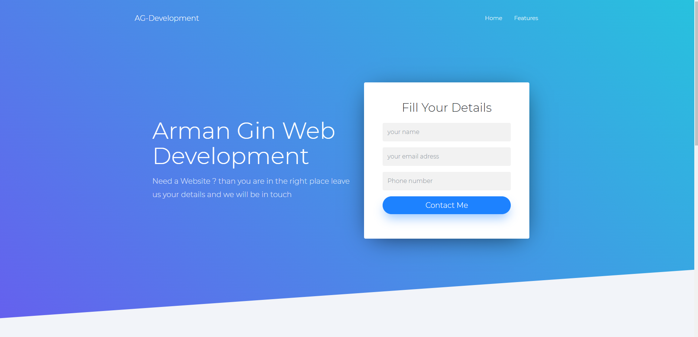

# Landing page

Landing page created using JQuery and PHP with MySQL database.

### How to use?

- use xammp to run the project locally on your machine.
- create a database in PhpMyAdmin and import the SQL file
- enjoy
